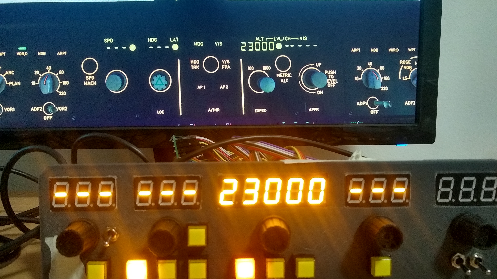

###Laurenzo's Universal Autopilot and Radio Panel (LUARP)
As most 3rd party addon aircraft for X-Plane use different custom datarefs, you can't use the same Mobiflight profile for all your planes.
This project solves the problem.

###How to install and use
You need to have FlyWithLua for X-Plane installed. Once that is done, simply place the LUARP.lua script file in your FlyWithLua/scripts folder. 
Then, configure your mobiflight profile to use the new datarefs and commands. You can use DataRefTool to find the datarefs and commands. 
For instance, "FlyWithLua/LUARP_DRAWN_SPEED" is the speed set in the autopilot, and command "FlyWithLua/LUARP_COMMAND_SPEED_UP" changes the speed up by one knot.

###My personal setup
I created this project to be able to use my own autopilot and radio panels with all planes easily without having to manually change and configure the profile every time I fly a different plane. You can see more pictures of my panels in the pictures folder of this repository. I'm using two Arduino megas, one for the autopilot and one for the radio panel. I designed the panels myself using sketchup, and planned the wirings using tinyCAD.

###Credits
Huge thanks to MobiFlight, for making home cockpit projects easy! 
https://github.com/MobiFlight/MobiFlight-Connector
